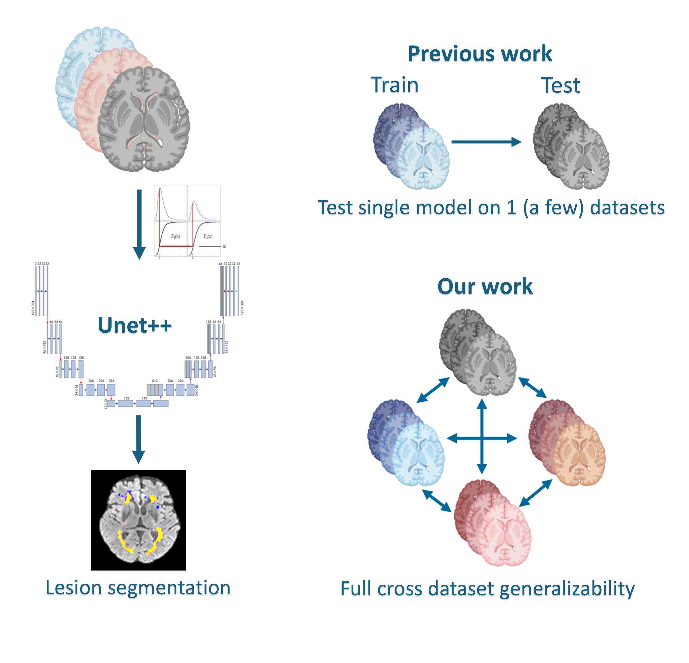

# MS Lesion Segmentation

We study whether multiple sclerosis lesion segmentation models can be trained to perform well across different datasets.

A pipeline for multiple sclerosis lesion Segmentation using PyTorch and [segmentation-models-pytorch](https://github.com/qubvel-org/segmentation_models.pytorch)([v0.3.3](https://github.com/qubvel-org/segmentation_models.pytorch/releases/tag/v0.3.3)).

<p align="center">

</p>

The code is related to the article :
L. Badea and M. Popa, ["Toward Generalizable Multiple Sclerosis Lesion Segmentation Models,"](https://ieeexplore.ieee.org/document/11021622/) in IEEE Access, doi: 10.1109/ACCESS.2025.3576145.

```
@ARTICLE{11021622,
  author={Badea, Liviu and Popa, Maria},
  journal={IEEE Access},
  title={Toward Generalizable Multiple Sclerosis Lesion Segmentation Models},
  year={2025},
  volume={},
  number={},
  pages={1-1},
  keywords={Lesions;Training;Magnetic resonance imaging;Multiple sclerosis;Testing;Data models;Training data;Image segmentation;Brain modeling;Deep learning;Multiple Sclerosis (MS);Brain MRI;Lesion Segmentation;Deep Learning;UNet++;Model Generalizability;Quantile Normalization},
  doi={10.1109/ACCESS.2025.3576145}}

```

---

## Table of Contents

- [Installation](#installation)  
- [Repository Structure](#repository-structure)  
- [Downloading the Data](#downloading-the-data)  
- [Preprocessing](#preprocessing)  
- [Training & Testing](#training--testing)  

---

## Installation

1. **Install PyTorch**  
   Follow the instructions on the [official PyTorch website](https://pytorch.org/) to install the version compatible with your CUDA (or CPU-only) setup.

2. **Install Python dependencies**  
   From the root of this repository, run:  
   ```bash
   cd <package-root>/methods/MSL-segmentation-mni
   pip install -r requirements.txt
   ```
   
3. **Install the slightly modified version of Segmentation-models-pytorch**
   ```bash
   cd models/my_smp
   pip install -e .
   ```

4. **Install ANTs (Advanced Normalization Tools)**  
   Download and install ANTs for N4 bias field correction from:
   ```
   https://github.com/ANTsX/ANTs/releases
   ```
5. **Install FSL**
   Download and install FSL for reorient correction from:
   ```
   https://fsl.fmrib.ox.ac.uk/fsl/docs/#/install/linux
   ```

---

## Repository Structure

```
.
|--- Datasets
|--- methods
     |--- MSL-segmentation
          |--- models
          |--- processing_data
          |--- results
```

- **Datasets/**  
  Directory for downloaded and processed datasets (ISBI-2015, MSSEG-2016, 3D-MR-MS).

- **methods/MSL-segmentation/**  
  - **models/**  
    Contains model code for training and inference.  
  - **processing_data/**  
    Scripts for preprocessing raw MRI data (e.g., bias field correction, cropping, normalization).
  - **results/**  
    Directory for storing the trained models and the inference results
---

## Downloading the datasets
```bash
      cd Datasets
   ```

1. **MSSEG-2016**  
   - Request access   
     ```
     https://shanoir.irisa.fr/shanoir-ng/account/study/209/account-request?study=MSSEG%202016&function=consumer
     ```  
   - After approval, download and place the ZIP files here:  
     ```
     ./Datasets/MSSEG-2016/MSSEG-Training.zip
     ./Datasets/MSSEG-2016/MSSEG-Testing.zip
     ```
   - run the script to unzip the files
     ```bash
     ./get_MSSEG_2016_data.sh
     ```

2. **ISBI-2015**  
   - Request access   
     ```
     https://smart-stats-tools.org/lesion-challenge
     ```  
   - After approval, download and place them in:  
     ```
     ./Datasets/ISBI_2015/training_final_v4.zip
     ```
   - run the script to unzip the files
      ```bash
      ./get_ISBI_2015_data.sh
      ``` 

3. **3D-MR-MS**  
   Download 3D-MR-MS:  
   ```bash
   ./get_3D_MR_MS_data.sh
   ```  
   This will download and extract all necessary 3D-MR-MS volumes into `./Datasets/3D_MR_MS/`.

---

## Preprocessing

All preprocessing steps (bias field correction, normalization, coregistration to MNI) are handled by the scripts in `methods/MSL-segmentation/processing_data/`.

1. Change into the processing directory:  
   ```bash
   cd ../methods/MSL-segmentation/processing_data
   ```

2. Run the preprocessing script
   ```bash
   ./process_datasets.sh quantile
   ```
   This will:  
   - Apply N4 bias field correction (via ANTs) for 3D-MR-MS only (since it was already applied by the authors of the other datasets)
   - Normalize intensities using quantile normalization
   - Save processed 2D image and mask slices in `Datasets/Datasets_quantile/` to be used by training algorithm.

---

## Training & Testing

All model training and evaluation scripts are in `methods/MSL-segmentation/models/`.

1. Change into the `methods/MSL-segmentation/` directory:  
   ```bash
   cd ../
   ```

2. Launch multiple training and inference tasks with a single command:  
   ```bash
   python -m models.run_models
   ```  
   This script will:  
   - Load preprocessed data from the `Datasets/` folder  
   - Train models (e.g., U-Net, U-Net++), validate on the validation split, and save checkpoints  
   - Optionally run inference on test datasets and store prediction outputs

3. The script `models.run_models` runs multiple training and inference tasks specified in the form: 
```
{ 
    "Training datasets": ["Test dataset1", "Test dataset2", ...],
    "Training datasets": ["testonly", "Test dataset1", "Test dataset2", ...],  # this only tests the model trained on "Training datasets" on the respective tests datasets
    ...
}
```
For example:
``` 
tasks = {
    "MSSEG_2016_test": ["MSSEG_2016","3D_MR_MS","ISBI_2015"],
    "MSSEG_2016,3D_MR_MS,ISBI_2015": ["MSSEG_2016_test"],
}
```
We can train on combinations of datasets by simply enumerating them separated by `','`, for example `"MSSEG_2016,3D_MR_MS,ISBI_2015".`

The hyperparameters of the runs can be changed (edit `default_params` in `models.run_models.py`)

4. `run_models.py` invokes `run_model.py` for each individual training/inference task. **Common command-line options** are (see `python -m models.run_model -h` for full list):
   - `-m, --model`  Model architecture (e.g. `UnetPlusPlus`)  
   - `--encoder`   Encoder backbone (e.g. `resnet18`)  
   - `--loss`      Loss function (e.g. `weighted_bce`)  
   - `--optimizer` Optimizer (e.g `adam`)  
   - `--lr`        Learning rate (default: `0.01`)  
   - `--batch-size` Batch size (default: `80`)  
   - `--epochs`    Number of epochs (default: `50`)
   - `-t, --training` Run in training mode  
   - `-i, --inference` Run inference only

   Example:
   ```bash
   python -m models.run_models      -m UnetPlusPlus      --encoder resnet18      --loss weighted_bce      --optimizer adam      --lr 0.001      --batch-size 64      --epochs 50      --data-path "Datasets_tmp/Datasets_quantile/"      --images "slices_FLAIR_op_r"      --segmentations "slices_seg_r"      --val-ratio 0.2      -t
   ```

5. **Inference mode**  
   To run inference on a saved checkpoint (without further training):
   ```bash
   python -m models.run_models      --inference      --resume path/to/checkpoint.pth.tar      --data-path "Datasets/Datasets_quantile/"      --images "slices_FLAIR_op_r"      --segmentations "slices_seg_r"      --threshold 0.5      --save-predictions      --save-predictions-path "predictions_output/"
   
   ```
   This will:  
   - Load the checkpoint specified by `--resume`  
   - Build a test set over all patients in `args.datasets`  
   - Compute and log per-slice and per-patient metrics (IoU, Dice, lesion-wise F1)  
   - Save colorized overlay images (prediction vs. ground truth) under `predictions_output/`
   - save predictions in nifti format


6. **Prediction results** can be inspected using `fsleyes` in the inference results directory:
    ```bash
    fsleyes colored_pred.nii.gz flair.nii.gz
    ```
and selecting e.g. the `Cool` color palette for the prediction.

**Note:** The models trained in this work did not use data augmentation. Although data augmentation leads to better results, we did this deliberately,
since data augmentation would be a confounding factor when studying dataset combinations.

### 🛡️ License <a name="license"></a>
We included the [segmentation_models.pytorch](https://github.com/qubvel/segmentation_models.pytorch) by Pavel Yakubovskiy
in our code with minor modifications.
Project is distributed under [MIT License](https://github.com/marypopa//LICENSE)
